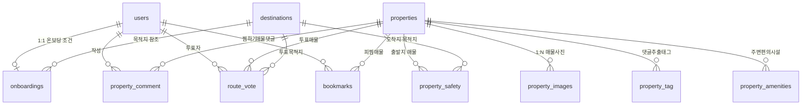

# 🗄️ [살고싶오] 데이터베이스 스키마 & DDL 명세서 (db_schema_reference.md)

본 문서는 **살고싶오(29반 1팀) - 낯선 지역 이주 시 주거 및 골목 귀갓길 안전 불안을 해소하기 위한, 안심 주거 매칭 플랫폼**의 **MySQL 데이터베이스 스키마, 11개 테이블 완전 DDL 스크립트, 외래키 관계 및 Mermaid ERD 다이어그램**을 정리한 DB 전용 명세서입니다.

---

## 📌 0. DB 설계 기본 규칙

- **DBMS**: MySQL 8.0+
- **Character Set / Collation**: `utf8mb4` / `utf8mb4_unicode_ci`
- **Naming Convention**: `snake_case` (테이블명은 복수형 기본, 연결 테이블은 단수/복수 조합)
- **공통 컬럼**: `created_at` (등록일시), `updated_at` (수정일시), `del_yn` (논리삭제 여부 `'N'/'Y'`)
- **인덱싱 전략**: 지도 영역 검색 성능 최적화를 위한 위경도 좌표 인덱스 (`idx_*_location`) 추가

---

## 📊 1. Mermaid ERD 다이어그램



---

## 🗄️ 2. 11개 테이블 DDL SQL 스크립트

### 1) 회원 테이블 (`users`)

```sql
-- 회원 테이블: 서비스 사용자 기본 계정 정보
CREATE TABLE users (
    user_id          INT AUTO_INCREMENT PRIMARY KEY,     -- 회원 고유 번호
    login_id         VARCHAR(50) NOT NULL UNIQUE,        -- 로그인 아이디
    password         VARCHAR(255) NOT NULL,              -- 암호화된 비밀번호
    name             VARCHAR(50) NOT NULL,               -- 이름
    birth_date       DATE NOT NULL,                      -- 생년월일
    gender           CHAR(1) NOT NULL,                   -- 성별 ('M': 남, 'F': 여)
    email            VARCHAR(100) NOT NULL,              -- 이메일
    del_yn           CHAR(1) NOT NULL DEFAULT 'N',       -- 탈퇴 여부 ('N': 정상, 'Y': 탈퇴, 논리삭제)
    created_at       DATETIME NOT NULL DEFAULT CURRENT_TIMESTAMP, -- 최초 등록일시
    updated_at       DATETIME NOT NULL DEFAULT CURRENT_TIMESTAMP ON UPDATE CURRENT_TIMESTAMP -- 최종 수정일시
);
```

---

### 2) 목적지 테이블 (`destinations`)

```sql
-- 목적지 테이블: 여러 회원이 공유하는 주 목적지 (학교/직장 등)
CREATE TABLE destinations (
    destination_id   INT AUTO_INCREMENT PRIMARY KEY,     -- 목적지 고유 번호
    dest_latitude    DECIMAL(12, 8) NOT NULL,            -- 위도 (-90 ~ 90)
    dest_longitude   DECIMAL(12, 8) NOT NULL,            -- 경도 (-180 ~ 180)
    dest_name        VARCHAR(100) NOT NULL,              -- 목적지명
    dest_address     VARCHAR(255) NULL,                  -- 도로명/지번 주소
    created_at       DATETIME NOT NULL DEFAULT CURRENT_TIMESTAMP, -- 등록 일시
    updated_at       DATETIME NOT NULL DEFAULT CURRENT_TIMESTAMP ON UPDATE CURRENT_TIMESTAMP, -- 수정 일시

    UNIQUE KEY uq_dest_location (dest_latitude, dest_longitude),    -- 같은 위치 중복 등록 방지
    INDEX idx_destinations_location (dest_latitude, dest_longitude) -- 좌표 기반 검색용 인덱스
);
```

---

### 3) 온보딩 테이블 (`onboardings`)

```sql
-- 온보딩 테이블: 회원이 설정한 주거 탐색 조건 (목적지, 예산, 이동수단 등)
CREATE TABLE onboardings (
    user_id          INT NOT NULL PRIMARY KEY,           -- 회원 ID (회원 1명당 온보딩 1개, 1:1 관계)
    destination_id   INT NOT NULL,                       -- 목적지 ID
    destination_type ENUM('SCHOOL', 'WORK', 'ETC') NOT NULL DEFAULT 'WORK', -- 목적지 유형 (학교/직장/기타)
    transport_mode   ENUM('WALK', 'TRANSIT') NOT NULL DEFAULT 'TRANSIT',    -- 이동수단 (도보/대중교통)
    max_travel_time  SMALLINT NOT NULL DEFAULT 15,       -- 최대 출퇴근 소요 시간 (단위: 분)
    budget_deposit   INT NOT NULL,                       -- 보증금 예산 (단위: 만원)
    budget_rent      INT NOT NULL,                       -- 월세 예산 (단위: 만원)
    min_safety_score TINYINT NOT NULL DEFAULT 0,         -- 최소 안전 점수 (0~100)
    created_at       DATETIME NOT NULL DEFAULT CURRENT_TIMESTAMP, -- 등록 일시
    updated_at       DATETIME NOT NULL DEFAULT CURRENT_TIMESTAMP ON UPDATE CURRENT_TIMESTAMP, -- 수정 일시

    CONSTRAINT fk_onboardings_users FOREIGN KEY (user_id) REFERENCES users(user_id), -- 회원 참조
    CONSTRAINT fk_onboardings_destinations FOREIGN KEY (destination_id) REFERENCES destinations(destination_id) -- 목적지 참조
);
```

---

### 4) 매물 테이블 (`properties`)

```sql
-- 매물 테이블: 매물 기본 정보 (주소, 가격, 면적, 위반건축물 여부 등)
CREATE TABLE properties (
    property_id          INT AUTO_INCREMENT PRIMARY KEY,     -- 매물 고유 번호
    property_latitude    DECIMAL(12, 8) NOT NULL,            -- 위도 (-90 ~ 90)
    property_longitude   DECIMAL(12, 8) NOT NULL,            -- 경도 (-180 ~ 180)
    address              VARCHAR(255) NOT NULL,              -- 매물 상세 주소
    building_type        TINYINT NOT NULL,                   -- 건물 종류 1: 빌라(연립다세대), 2: 다가구, 3: 오피스텔
    room_type            TINYINT NOT NULL,                   -- 방 종류 (1: 원룸, 2: 투룸)
    deposit              INT NOT NULL DEFAULT 0,             -- 보증금 (단위: 만원)
    monthly_rent         INT NOT NULL DEFAULT 0,             -- 월세 (단위: 만원 / 0일 경우 전세)
    area                 DECIMAL(6, 2) NOT NULL,             -- 전용면적 (단위: m²)
    floor                TINYINT NOT NULL,                   -- 해당 층수 (반지하는 -1, -2 등으로 표현)
    built_year           CHAR(4) NOT NULL,                   -- 준공연도 (YYYY)
    is_illegal_building  BOOLEAN NOT NULL DEFAULT FALSE,     -- 위반건축물 여부
    del_yn               CHAR(1) NOT NULL DEFAULT 'N',       -- 삭제 여부 ('N': 정상/거래중, 'Y': 삭제/계약완료)
    created_at           DATETIME NOT NULL DEFAULT CURRENT_TIMESTAMP, -- 매물 등록 일시
    updated_at           DATETIME NOT NULL DEFAULT CURRENT_TIMESTAMP ON UPDATE CURRENT_TIMESTAMP, -- 매물 수정 일시

    UNIQUE KEY uq_property_location (property_latitude, property_longitude),  -- 같은 위치 매물 중복 등록 방지
    INDEX idx_properties_location (property_latitude, property_longitude)     -- 좌표 기반 검색(지도 범위검색)용 인덱스
);
```

---

### 5) 매물 이미지 테이블 (`property_images`)

```sql
-- 매물 이미지 테이블: 매물 1개당 사진 여러 장 (1:N 관계)
CREATE TABLE property_images (
    image_id      INT AUTO_INCREMENT PRIMARY KEY,     -- 이미지 고유 번호
    property_id   INT NOT NULL,                       -- 매물 ID
    image_url     VARCHAR(500) NOT NULL,              -- 이미지 파일 URL 경로
    display_order TINYINT NOT NULL DEFAULT 1,         -- 사진 표시 순서 (1~127)
    created_at    DATETIME NOT NULL DEFAULT CURRENT_TIMESTAMP, -- 이미지 등록 일시

    CONSTRAINT fk_pi_properties FOREIGN KEY (property_id) REFERENCES properties(property_id), -- 매물 참조
    INDEX idx_pi_property_id (property_id) -- 매물별 이미지 조회용 인덱스
);
```

---

### 6) 댓글 테이블 (`property_comment`)

```sql
-- 매물 댓글 테이블: 실거주자 후기 (태그 자동추출의 원본 데이터)
CREATE TABLE property_comment (
    comment_id   INT AUTO_INCREMENT PRIMARY KEY,     -- 댓글 고유 ID
    property_id  INT NOT NULL,                       -- 매물 ID
    user_id      INT NOT NULL,                       -- 작성자 ID
    content      VARCHAR(255) NOT NULL,              -- 댓글 내용
    del_yn       CHAR(1) NOT NULL DEFAULT 'N',       -- 삭제 여부 ('N': 노출, 'Y': 삭제)
    created_at   DATETIME NOT NULL DEFAULT CURRENT_TIMESTAMP, -- 작성 일시
    updated_at   DATETIME NOT NULL DEFAULT CURRENT_TIMESTAMP ON UPDATE CURRENT_TIMESTAMP, -- 수정 일시

    CONSTRAINT fk_comment_properties FOREIGN KEY (property_id) REFERENCES properties(property_id),
    CONSTRAINT fk_comment_users FOREIGN KEY (user_id) REFERENCES users(user_id),
    INDEX idx_comment_property (property_id, del_yn)
);
```

---

### 7) 태그 테이블 (`property_tag`)

```sql
-- 매물 특징 태그 테이블: 댓글에서 키워드 분석으로 자동 추출된 태그와 언급 횟수
CREATE TABLE property_tag (
    property_id  INT NOT NULL,                       -- 매물 ID
    tag_type     TINYINT NOT NULL,                   -- 태그 종류 (1: 곰팡이, 2: 햇살좋음, 3: 소음 등 8개 구분값)
    tag_count    INT NOT NULL DEFAULT 1,             -- 매물 댓글 내 태그 언급 횟수
    updated_at   DATETIME NOT NULL DEFAULT CURRENT_TIMESTAMP ON UPDATE CURRENT_TIMESTAMP,

    PRIMARY KEY (property_id, tag_type), -- 매물 + 태그종류 조합이 유일 (복합 PK)
    CONSTRAINT fk_tag_properties FOREIGN KEY (property_id) REFERENCES properties(property_id)
);
```

---

### 8) 안전 귀갓길 테이블 (`property_safety`)

```sql
-- 안전 귀갓길 점수 테이블: 매물-목적지 조합별 안전점수
CREATE TABLE property_safety (
    property_id         INT NOT NULL,                         -- 출발지: 매물 고유 ID
    destination_id      INT NOT NULL,                         -- 도착지: 목적지 고유 ID
    safety_score        TINYINT UNSIGNED NOT NULL DEFAULT 0,  -- 안전 점수 (0~100점)
    cctv_count          SMALLINT UNSIGNED NOT NULL DEFAULT 0, -- 경로 내 CCTV 개수
    street_lamp_count   SMALLINT UNSIGNED NOT NULL DEFAULT 0, -- 경로 내 보안등+가로등 개수
    has_police_station  BOOLEAN NOT NULL DEFAULT FALSE,       -- 경로 내 파출소 존재 여부
    created_at          DATETIME NOT NULL DEFAULT CURRENT_TIMESTAMP,
    updated_at          DATETIME NOT NULL DEFAULT CURRENT_TIMESTAMP ON UPDATE CURRENT_TIMESTAMP,

    PRIMARY KEY (property_id, destination_id), -- 복합 PK
    CONSTRAINT fk_safety_properties FOREIGN KEY (property_id) REFERENCES properties(property_id),
    CONSTRAINT fk_safety_destinations FOREIGN KEY (destination_id) REFERENCES destinations(destination_id),
    INDEX idx_safety_destination (destination_id)
);
```

---

### 9) 경로 만족도 테이블 (`route_vote`)

```sql
-- 경로 만족도 투표 테이블: 실사용자의 안전 체감 투표
CREATE TABLE route_vote (
    vote_id         INT AUTO_INCREMENT PRIMARY KEY,     -- 투표 고유 ID
    user_id         INT NOT NULL,                       -- 투표한 사용자 ID
    property_id     INT NOT NULL,                       -- 출발지: 매물 ID
    destination_id  INT NOT NULL,                       -- 도착지: 목적지 ID
    vote_type       ENUM('SAFE', 'UNSAFE') NOT NULL,    -- 투표 유형 ('SAFE': 안전, 'UNSAFE': 위험)
    del_yn          CHAR(1) NOT NULL DEFAULT 'N',       -- 삭제 여부
    created_at      DATETIME NOT NULL DEFAULT CURRENT_TIMESTAMP,
    updated_at      DATETIME NOT NULL DEFAULT CURRENT_TIMESTAMP ON UPDATE CURRENT_TIMESTAMP,

    CONSTRAINT fk_vote_users FOREIGN KEY (user_id) REFERENCES users(user_id),
    CONSTRAINT fk_vote_properties FOREIGN KEY (property_id) REFERENCES properties(property_id),
    CONSTRAINT fk_vote_destinations FOREIGN KEY (destination_id) REFERENCES destinations(destination_id),
    UNIQUE KEY uq_user_route (user_id, property_id, destination_id) -- 같은 경로 중복투표 방지
);
```

---

### 10) 편의시설 테이블 (`property_amenities`)

```sql
-- 편의시설 테이블: 매물별 주변 편의시설(카페/편의점 등)까지의 거리·시간
CREATE TABLE property_amenities (
    property_id        INT NOT NULL,                       -- 매물 고유 ID
    amenity_type       TINYINT NOT NULL,                   -- 편의시설 종류 (1: 편의점, 2: 카페, 3: 대형마트, 4: 약국 등)
    amenity_name       VARCHAR(100) NOT NULL,              -- 편의시설 이름
    amenity_latitude   DECIMAL(12, 8) NOT NULL,            -- 위도
    amenity_longitude  DECIMAL(12, 8) NOT NULL,            -- 경도
    distance_meters    SMALLINT UNSIGNED NOT NULL,         -- 도보 거리 (단위: m)
    walk_time_minutes  TINYINT UNSIGNED NOT NULL,          -- 도보 소요 시간 (단위: 분)
    created_at         DATETIME NOT NULL DEFAULT CURRENT_TIMESTAMP,
    updated_at         DATETIME NOT NULL DEFAULT CURRENT_TIMESTAMP ON UPDATE CURRENT_TIMESTAMP,

    PRIMARY KEY (property_id, amenity_type), -- 매물 + 편의시설종류 조합 유일
    CONSTRAINT fk_amenities_properties FOREIGN KEY (property_id) REFERENCES properties(property_id)
);
```

---

### 11) 관심 매물 테이블 (`bookmarks`)

```sql
-- 관심 매물 테이블: 회원이 찜한 매물 (N:N 관계)
CREATE TABLE bookmarks (
    user_id      INT NOT NULL,                       -- 회원 고유 ID
    property_id  INT NOT NULL,                       -- 매물 고유 ID
    created_at   DATETIME NOT NULL DEFAULT CURRENT_TIMESTAMP,

    PRIMARY KEY (user_id, property_id), -- 복합 PK
    CONSTRAINT fk_bookmarks_users FOREIGN KEY (user_id) REFERENCES users(user_id),
    CONSTRAINT fk_bookmarks_properties FOREIGN KEY (property_id) REFERENCES properties(property_id)
);
```
