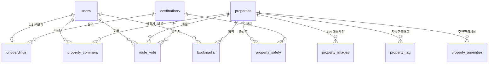

# 📝 [살고싶오] 노션 정리 & 개발 스펙 문서 (Markdown)

본 문서는 프로젝트 노션 정리 문서(`노션 정리.txt`)를 바탕으로 작성된 **프로젝트 가이드라인, 10개 테이블 MySQL DDL 및 Mermaid ERD, 기술 스택, Git 협업 규칙 및 PR 컨벤션** 종합 개발 가이드입니다.

---

## 📌 1. 프로젝트 가이드라인 & 세부 수행 과업

### ■ 프로젝트 개요
- **주제**: ⑤ 안전한 부동산 거래를 위한 부동산 정보 도우미 (팀명: 살고싶오)
- **핵심 목표**: 빌라촌 거주자를 위해 건물 안전(위반건축물·연식) 및 거리 안전(CCTV·가로등)을 고려한 안심 부동산 매칭 플랫폼 개발.
- **기본 개발 규격**: **Vue 3 (Composition API)** + **Spring Framework (Java 17, MyBatis)** 기반 구현.

### ■ 세부 수행 과업 (R&R)
1. **부동산 데이터 및 API 연동**: 국토교통부, 건축물대장 API, 법원 부동산 등기 API 조사.
2. **금융 연계 설계**: KB 부동산 담보 대출 금리 한도 연동 API 및 주택 청약 데이터 설계.
3. **데이터 모델링 & ERD**: 10개 핵심 테이블 설계 및 릴레이션십 정립.
4. **UI/UX 프론트엔드 설계**: Naver/Kakao Map API 기반 지도 시각화, 편의시설 도보 제한 필터, 통계/그래프 시각화.
5. **백엔드 API 가공 & Swagger**: REST API 설계, Swagger 문서화, 개인 관심사 추적 기능.

---

## 🗄️ 2. 데이터베이스 스키마 (10개 테이블 MySQL DDL)

### 1) 회원 테이블 (`users`)
```sql
CREATE TABLE users (
    user_id          INT AUTO_INCREMENT PRIMARY KEY,     -- 회원 고유 번호
    login_id         VARCHAR(50) NOT NULL UNIQUE,        -- 로그인 아이디
    password         VARCHAR(255) NOT NULL,              -- 암호화된 비밀번호
    name             VARCHAR(50) NOT NULL,              -- 이름
    birth_date       DATE NOT NULL,                      -- 생년월일
    gender           CHAR(1) NOT NULL,                   -- 성별 ('M': 남, 'F': 여)
    email            VARCHAR(100) NOT NULL,              -- 이메일
    del_yn           CHAR(1) NOT NULL DEFAULT 'N',       -- 탈퇴 여부 ('N': 정상, 'Y': 탈퇴)
    created_at       DATETIME NOT NULL DEFAULT CURRENT_TIMESTAMP, -- 최초 등록일시
    updated_at       DATETIME NOT NULL DEFAULT CURRENT_TIMESTAMP ON UPDATE CURRENT_TIMESTAMP -- 최종 수정일시
);
```

### 2) 목적지 테이블 (`destinations`)
```sql
CREATE TABLE destinations (
    destination_id   INT AUTO_INCREMENT PRIMARY KEY,     -- 목적지 고유 번호
    dest_latitude    DECIMAL(12, 8) NOT NULL,            -- 위도 (-90 ~ 90)
    dest_longitude   DECIMAL(12, 8) NOT NULL,            -- 경도 (-180 ~ 180)
    dest_name        VARCHAR(100) NOT NULL,              -- 목적지명
    dest_address     VARCHAR(255) NULL,                  -- 도로명/지번 주소
    created_at       DATETIME NOT NULL DEFAULT CURRENT_TIMESTAMP,
    updated_at       DATETIME NOT NULL DEFAULT CURRENT_TIMESTAMP ON UPDATE CURRENT_TIMESTAMP,
 
    UNIQUE KEY uq_dest_location (dest_latitude, dest_longitude),
    INDEX idx_destinations_location (dest_latitude, dest_longitude)
);
```

### 3) 온보딩 테이블 (`onboardings`)
```sql
CREATE TABLE onboardings (
    user_id          INT NOT NULL PRIMARY KEY,           -- 회원 ID (1:1 관계)
    destination_id   INT NOT NULL,                       -- 목적지 ID
    destination_type ENUM('SCHOOL', 'WORK', 'ETC') NOT NULL DEFAULT 'WORK', -- 목적지 유형
    transport_mode   ENUM('WALK', 'TRANSIT') NOT NULL DEFAULT 'TRANSIT',    -- 이동수단
    max_travel_time  SMALLINT NOT NULL DEFAULT 15,       -- 최대 출퇴근 소요 시간 (분)
    budget_deposit   INT NOT NULL,                       -- 보증금 예산 (만원)
    budget_rent      INT NOT NULL,                       -- 월세 예산 (만원)
    min_safety_score TINYINT NOT NULL DEFAULT 0,         -- 최소 안전 점수 (0~100)
    created_at       DATETIME NOT NULL DEFAULT CURRENT_TIMESTAMP,
    updated_at       DATETIME NOT NULL DEFAULT CURRENT_TIMESTAMP ON UPDATE CURRENT_TIMESTAMP,
 
    CONSTRAINT fk_onboardings_users FOREIGN KEY (user_id) REFERENCES users(user_id),
    CONSTRAINT fk_onboardings_destinations FOREIGN KEY (destination_id) REFERENCES destinations(destination_id)
);
```

### 4) 매물 테이블 (`properties`)
```sql
CREATE TABLE properties (
    property_id          INT AUTO_INCREMENT PRIMARY KEY,     -- 매물 고유 번호
    property_latitude    DECIMAL(12, 8) NOT NULL,            -- 위도
    property_longitude   DECIMAL(12, 8) NOT NULL,            -- 경도
    address              VARCHAR(255) NOT NULL,              -- 매물 상세 주소
    building_type        TINYINT NOT NULL,                   -- 1: 빌라(연립다세대), 2: 다가구, 3: 오피스텔
    room_type            TINYINT NOT NULL,                   -- 방 종류 (1: 원룸, 2: 투룸)
    deposit              INT NOT NULL DEFAULT 0,             -- 보증금 (만원)
    monthly_rent         INT NOT NULL DEFAULT 0,             -- 월세 (만원)
    area                 DECIMAL(6, 2) NOT NULL,             -- 전용면적 (m²)
    floor                TINYINT NOT NULL,                   -- 해당 층수
    built_year           CHAR(4) NOT NULL,                   -- 준공연도 (YYYY)
    is_illegal_building  BOOLEAN NOT NULL DEFAULT FALSE,     -- 위반건축물 여부
    del_yn               CHAR(1) NOT NULL DEFAULT 'N',       -- 삭제 여부
    created_at           DATETIME NOT NULL DEFAULT CURRENT_TIMESTAMP,
    updated_at           DATETIME NOT NULL DEFAULT CURRENT_TIMESTAMP ON UPDATE CURRENT_TIMESTAMP,
 
    UNIQUE KEY uq_property_location (property_latitude, property_longitude),
    INDEX idx_properties_location (property_latitude, property_longitude)
);
```

### 5) 매물 이미지 테이블 (`property_images`)
```sql
CREATE TABLE property_images (
    image_id      INT AUTO_INCREMENT PRIMARY KEY,
    property_id   INT NOT NULL,
    image_url     VARCHAR(500) NOT NULL,
    display_order TINYINT NOT NULL DEFAULT 1,
    created_at    DATETIME NOT NULL DEFAULT CURRENT_TIMESTAMP,
 
    CONSTRAINT fk_pi_properties FOREIGN KEY (property_id) REFERENCES properties(property_id),
    INDEX idx_pi_property_id (property_id)
);
```

### 6) 댓글 테이블 (`property_comment`)
```sql
CREATE TABLE property_comment (
    comment_id   INT AUTO_INCREMENT PRIMARY KEY,
    property_id  INT NOT NULL,
    user_id      INT NOT NULL,
    content      VARCHAR(255) NOT NULL,
    del_yn       CHAR(1) NOT NULL DEFAULT 'N',
    created_at   DATETIME NOT NULL DEFAULT CURRENT_TIMESTAMP,
    updated_at   DATETIME NOT NULL DEFAULT CURRENT_TIMESTAMP ON UPDATE CURRENT_TIMESTAMP,
 
    CONSTRAINT fk_comment_properties FOREIGN KEY (property_id) REFERENCES properties(property_id),
    CONSTRAINT fk_comment_users FOREIGN KEY (user_id) REFERENCES users(user_id),
    INDEX idx_comment_property (property_id, del_yn)
);
```

### 7) 태그 테이블 (`property_tag`)
```sql
CREATE TABLE property_tag (
    property_id  INT NOT NULL,
    tag_type     TINYINT NOT NULL,                   -- 1: 곰팡이, 2: 햇살좋음, 3: 소음 등 8개 구분값
    tag_count    INT NOT NULL DEFAULT 1,
    updated_at   DATETIME NOT NULL DEFAULT CURRENT_TIMESTAMP ON UPDATE CURRENT_TIMESTAMP,
 
    PRIMARY KEY (property_id, tag_type),
    CONSTRAINT fk_tag_properties FOREIGN KEY (property_id) REFERENCES properties(property_id)
);
```

### 8) 안전 귀갓길 테이블 (`property_safety`)
```sql
CREATE TABLE property_safety (
    property_id         INT NOT NULL,
    destination_id      INT NOT NULL,
    safety_score        TINYINT UNSIGNED NOT NULL DEFAULT 0,  -- 0~100점
    cctv_count          SMALLINT UNSIGNED NOT NULL DEFAULT 0,
    street_lamp_count   SMALLINT UNSIGNED NOT NULL DEFAULT 0,
    has_police_station  BOOLEAN NOT NULL DEFAULT FALSE,
    created_at          DATETIME NOT NULL DEFAULT CURRENT_TIMESTAMP,
    updated_at          DATETIME NOT NULL DEFAULT CURRENT_TIMESTAMP ON UPDATE CURRENT_TIMESTAMP,
 
    PRIMARY KEY (property_id, destination_id),
    CONSTRAINT fk_safety_properties FOREIGN KEY (property_id) REFERENCES properties(property_id),
    CONSTRAINT fk_safety_destinations FOREIGN KEY (destination_id) REFERENCES destinations(destination_id),
    INDEX idx_safety_destination (destination_id)
);
```

### 9) 경로 만족도 테이블 (`route_vote`)
```sql
CREATE TABLE route_vote (
    vote_id         INT AUTO_INCREMENT PRIMARY KEY,
    user_id         INT NOT NULL,
    property_id     INT NOT NULL,
    destination_id  INT NOT NULL,
    vote_type       ENUM('SAFE', 'UNSAFE') NOT NULL,
    del_yn          CHAR(1) NOT NULL DEFAULT 'N',
    created_at      DATETIME NOT NULL DEFAULT CURRENT_TIMESTAMP,
    updated_at      DATETIME NOT NULL DEFAULT CURRENT_TIMESTAMP ON UPDATE CURRENT_TIMESTAMP,
 
    CONSTRAINT fk_vote_users FOREIGN KEY (user_id) REFERENCES users(user_id),
    CONSTRAINT fk_vote_properties FOREIGN KEY (property_id) REFERENCES properties(property_id),
    CONSTRAINT fk_vote_destinations FOREIGN KEY (destination_id) REFERENCES destinations(destination_id),
    UNIQUE KEY uq_user_route (user_id, property_id, destination_id)
);
```

### 10) 편의시설 테이블 (`property_amenities`)
```sql
CREATE TABLE property_amenities (
    property_id        INT NOT NULL,
    amenity_type       TINYINT NOT NULL,                   -- 1: 편의점, 2: 카페, 3: 대형마트 등
    amenity_name       VARCHAR(100) NOT NULL,
    amenity_latitude   DECIMAL(12, 8) NOT NULL,
    amenity_longitude  DECIMAL(12, 8) NOT NULL,
    distance_meters    SMALLINT UNSIGNED NOT NULL,
    walk_time_minutes  TINYINT UNSIGNED NOT NULL,
    created_at         DATETIME NOT NULL DEFAULT CURRENT_TIMESTAMP,
    updated_at         DATETIME NOT NULL DEFAULT CURRENT_TIMESTAMP ON UPDATE CURRENT_TIMESTAMP,
 
    PRIMARY KEY (property_id, amenity_type),
    CONSTRAINT fk_amenities_properties FOREIGN KEY (property_id) REFERENCES properties(property_id)
);
```

### 11) 관심 매물 테이블 (`bookmarks`)
```sql
CREATE TABLE bookmarks (
    user_id      INT NOT NULL,
    property_id  INT NOT NULL,
    created_at   DATETIME NOT NULL DEFAULT CURRENT_TIMESTAMP,
 
    PRIMARY KEY (user_id, property_id),
    CONSTRAINT fk_bookmarks_users FOREIGN KEY (user_id) REFERENCES users(user_id),
    CONSTRAINT fk_bookmarks_properties FOREIGN KEY (property_id) REFERENCES properties(property_id)
);
```

---

## 📊 3. Mermaid ERD 다이어그램



---

## ⚡ 4. 기술 스택 & 개발 환경 명세

- **Backend**: Java 17, Spring Legacy / Boot, Spring Security (JWT), MyBatis, MySQL
- **Frontend**: Vue 3 (Composition API / `<script setup>`), JavaScript (ES6+), Pinia, Vue Router, Tailwind CSS
- **External API**: Naver Map API, Naver Directions API, ODsay API
- **Tools**: IntelliJ IDEA, GitHub, Postman, dbdiagram.io, Figma, Notion

---

## 🌿 5. Git 협업 규칙 & 커밋/PR 컨벤션

### 1) 브랜치 전략
```
main (배포/제출용, PR로만 merge)
  └─ develop (통합 브랜치)
       ├─ feature/login-signup       (구혜성)
       ├─ feature/onboarding         (안효선)
       ├─ feature/property-map       (김민준)
       ├─ feature/safety-score       (김병승)
       └─ feature/amenities-filter   (송은지)
```

### 2) 커밋 메시지 컨벤션
- `feat`: 새 기능 추가
- `fix`: 버경 수정
- `refactor`: 코드 개선 (로직 변화 없음)
- `docs`: 문서 수정
- `style`: 코드 포맷팅
- `chore`: 빌드/패키지 설정

### 3) PR 및 충돌 관리 규칙
- **"고봉밥 PR" 금지**: 파일 10개, 500줄 이상의 대형 커밋을 자제하고 1개 기능 단위로 분할 PR.
- **팀원 최소 1명 Approve 후 merge**: 본인 PR 셀프 머지 금지.
- **매일 작업 시작 시**: `git pull origin develop` 필수 실행.
- **그레이존 담당**: `RootConfig`, `application.properties` 등 공통 파일 수정 시 슬랙 공지 후 진행.
