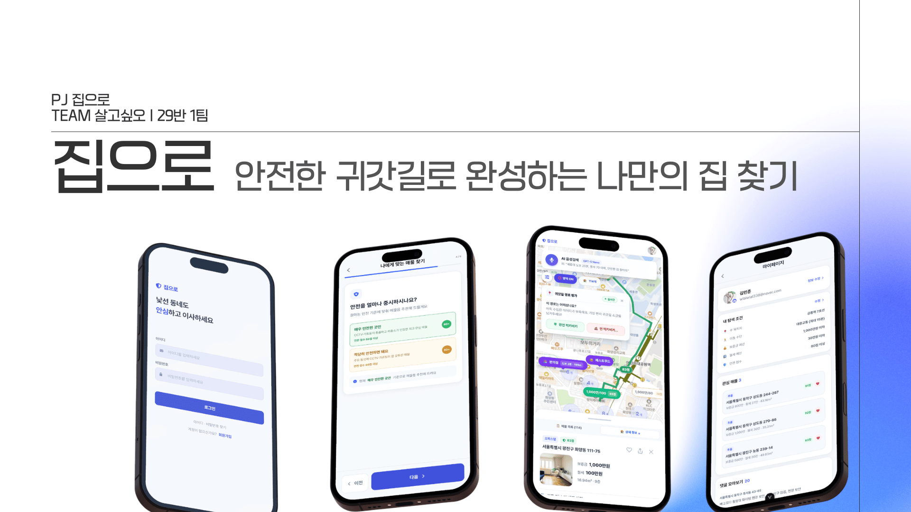
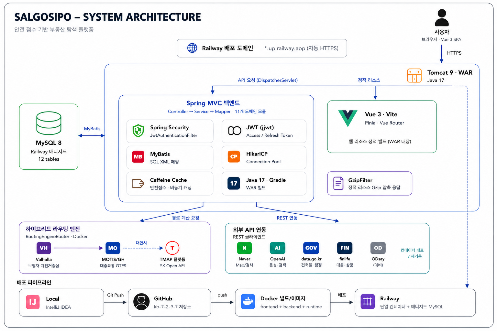
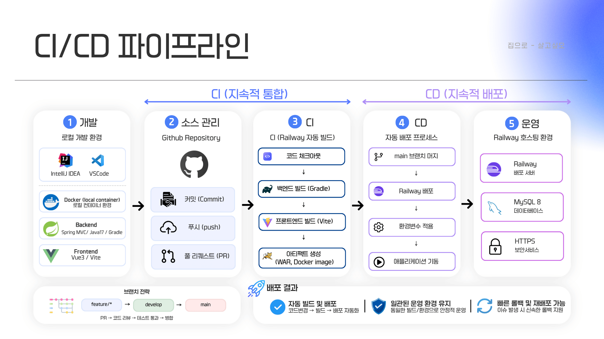
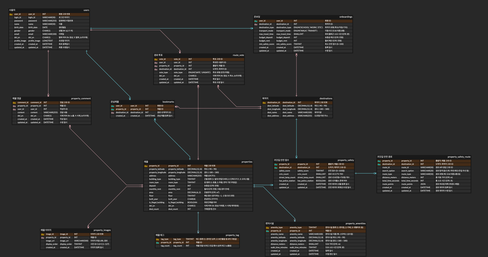

<table style="border: none; border-collapse: collapse;">
  <tr style="border: none;">
    <td width="55%" align="center" valign="middle" style="border: none;">
      
    </td>
    <td width="45%" valign="middle" style="border: none;">
      <h3 style="margin: 0 0 4px 0;">🏠 집으로</h3>
      <h5 style="margin: 0 0 8px 0; color: #4b5563;">안전한 귀갓길로 완성하는 나만의 집 찾기</h5>
      <p style="margin: 0 0 10px 0;"><small><b>주거 안전 + 귀갓길 안전 + 조건별 대출 매칭을<br/>하나의 지도에서 해결하는 안심 주거 솔루션</b></small></p>
      <p style="margin: 0 0 10px 0;">
        <a href="https://vuejs.org/"></a>
        <a href="https://spring.io/"></a>
        <a href="https://www.oracle.com/java/"></a><br/>
        <a href="https://www.mysql.com/"></a>
        <a href="https://www.docker.com/"></a>
      </p>
      <p style="margin: 0;"><small>
        📅 <b>기간</b>: 2026.07 – 2026.08 &nbsp;<br/>
        👥 <b>팀</b>: 살고싶오 (29반 1팀, 5인)<br/>
        🔗 <a href="https://github.com/kb-7-29-1/kb">GitHub 저장소</a> &nbsp;<br/>
        🌐 <a href="https://salgosipo.site/">salgosipo.site (배포 사이트)</a>
      </small></p>
    </td>
  </tr>
</table>

---

## 💡 왜 만들었나요

> "집을 구할 때 왜 안전과 생활환경은 한눈에 비교하기 어려울까?"

1~2년 단기 계약이 잦은 **대학생·사회초년생·1인 가구**는 짧은 시간 안에 낯선 동네의 매물을 결정해야 합니다.
하지만 기존 부동산 플랫폼은 시세와 매물 정보만 보여줄 뿐, **"이 동네를 걸어 다녀도 안전한가?"**, **"이 건물은 법적으로 문제없나?"**, **"내 조건에 맞는 대출은 뭔가?"** 에는 답해주지 않습니다.

흩어진 안전·생활환경·금융 정보를 하나로 연결해, 안심하고 집을 선택할 수 있게 만든 것이 **집으로**입니다.

| 기존 서비스                    | 집으로                                   |
| ------------------------------ |---------------------------------------|
| 매물 시세·구조 정보 위주       | **건물 안전 + 거리 안전 + 금융**을 통합 제공         |
| 안전 정보는 사용자가 직접 검색 | CCTV·가로등·파출소 기반 **CPTED 안전 점수 자동 산출** |
| 대출은 별도로 은행 앱에서 확인 | 매물 보증금·예산·나이 조건에 맞는 **대출 상품 소개/추천**   |

---

## ✨ 핵심 기능

**3단계 흐름**: 🎯 맞춤 조건 설정(원하는 조건·우선순위로 매물 탐색) → 🚶 실제 귀갓길 분석(CCTV·가로등·파출소 데이터 기반 안전 점수) → 🏙️ 생활권 비교(주변 편의시설로 생활 편의성 확인)

| #   | 기능                            | 설명                                                                   |
| --- | ------------------------------- |----------------------------------------------------------------------|
| 1   | 🎯 **초개인화 온보딩**          | 목적지(직장/학교) · 이동 수단 · 보증금/월세 예산 · 안전 선호도를 단계별 수집                      |
| 2   | 🗺️ **지도 & 매물 탐색**         | 목적지 기준 도보권 시각화, 편의시설(편의점/카페/마트) 필터, 매물 마커                            |
| 3   | 🏢 **건물 안전 정보**           | 위반건축물 여부, 준공연식 표시                                                    |
| 4   | 🚨 **거리 안전 점수 (CPTED)**   | CCTV·가로등 밀도, 파출소 접근성 기반 **0~100점 안전 점수** + 안심 귀갓길 경로 시각화 + 경로 만족도 투표 |
| 5   | 💬 **실거주 댓글 & 태그**       | 댓글 키워드를 자동 추출해 매물 특징 태그 배지 생성                                        |
| 6   | ⭐ **관심 매물(찜)**            | 찜하기/해제, 마이페이지 목록 관리                                                  |
| 7   | 💰 **예산·나이 기반 금융 매칭** | 보증금·예산·나이 조건 기반 대출 상품 소개/추천, 은행 로고 표시, 클릭 시 은행 사이트 이동                |
| 8   | 👤 **회원 관리**                | 회원가입/로그인(JWT), 아이디·비밀번호 찾기, 프로필 수정, 회원 탈퇴                            |
| 9   | 🔐 **세션 관리**                | 멀티탭 로그아웃 동기화, 세션 만료 임박 알림 및 연장                                       |

---

## 🖼️ 화면 흐름 (UI/UX)

전체 화면 흐름은 [UIUX 설명서.pdf](docs/project/UIUX%20설명서.pdf), 서비스 한 장 요약은 [프로젝트 요약본.pdf](docs/project/프로젝트%20요약본.pdf)에 정리되어 있습니다.

| 흐름               | 화면                                                                           | 주요 기능                                                                                                                   |
| ------------------ | ------------------------------------------------------------------------------ | --------------------------------------------------------------------------------------------------------------------------- |
| **가입/인증**      | 로그인 · 회원가입                                                              | 아이디·비밀번호 로그인, 이메일 인증 기반 아이디/비밀번호 찾기, 회원가입 입력 폼                                             |
| **온보딩** (5단계) | 목적지 선택 → 이동 수단 선택 → 자산 정보 입력 → 안전 점수 설정 → 결과 화면     | 자주 가는 목적지, 도보/대중교통 선호, 보증금·월세 예산, 최소 안전 점수 기준을 단계별로 수집                                 |
| **탐색**           | 지도 페이지 · 전체 필터 · 편의시설 필터                                        | AI 음성 검색, 이동 가능 영역 표시, 매물 마커/클러스터링, 목적지·안전점수·거래유형·이동시간 필터, 매물 정렬                  |
| **매물 상세**      | 매물 상세 페이지 · 안전 점수 산정 기준 · 안전 시설 지도 표시 · 실거주 커뮤니티 | 귀갓길 경로 시각화 및 평가, 건물 정보(위반건축물·준공연식), CPTED 안전 점수(0~100점) 산정 근거, 추천 금융 상품, 실거주 댓글 |
| **마이페이지**     | 프로필 정보 수정 · 비밀번호 변경 · 회원 탈퇴                                   | 내 탐색 조건 재설정, 관심 매물·댓글 모아보기, 계정 관리                                                                     |

---

## 🧱 기술 스택

| 분류                            | 기술 스택 & 라이브러리                              | 상세 내용                                                                    |
| ------------------------------- | --------------------------------------------------- | ---------------------------------------------------------------------------- |
| **🎨 Frontend**<br/>`frontend/` | **Vue 3**, **Vite**, **Pinia**, **Vue Router**      | Composition API (`<script setup>`), Tailwind CSS, Axios, Naver Map API       |
| **⚙️ Backend**<br/>`backend/`   | **Java 17**, **Spring 5 (Legacy)**, **MyBatis**     | Tomcat 9 (WAR), Spring Security + JWT (`jjwt`), MySQL 8.0, HikariCP          |
| **🗺️ Routing**                  | **Valhalla (Docker)**, **MOTIS (Docker)**, **Tmap** | 하이브리드 라우팅 (Valhalla 도보 기본 + Tmap 자동 폴백, MOTIS GTFS 대중교통) |
| **☁️ Infra & CI/CD**            | **Docker**, **Railway**, **GitHub**                 | 컨테이너 가상화, Railway 자동 빌드/배포, GitHub 브랜치 협업 전략             |
| **🔌 외부 연동**                | **국토교통부**, **금융감독원 finlife**, **Naver**   | 건축물대장 공공데이터, 전세자금대출 상품 검색 API, Naver 지도/검색 API       |

---

## 🏗️ 시스템 아키텍처

Vue 3 SPA가 Spring MVC(WAR)에 붙고, Tomcat이 정적 리소스와 API 요청을 분기합니다.
도보 경로는 Valhalla(Docker)가 기본 엔진이며, 컨테이너가 죽으면 Tmap으로 자동 폴백합니다. 대중교통 경로는 MOTIS(Docker) 전용이며 별도 폴백은 없습니다.



---

## 🔄 CI/CD 파이프라인

GitHub Repository(`main` 브랜치)와 Railway를 연동하여 코드 체크아웃, Gradle/Vite 빌드, 아티팩트(WAR, Docker) 생성 및 배포를 자동화한 CI/CD 파이프라인 구조입니다.



---

## 📁 프로젝트 구조

```
kb/
├── frontend/                 # Vue 3 + Vite 프론트엔드
│   └── src/
│       ├── api/               # Axios 인스턴스 및 도메인별 API 모듈
│       ├── components/        # 도메인별 재사용 컴포넌트
│       ├── composables/       # 재사용 가능한 Composition 함수
│       ├── pages/              # 라우트 단위 페이지
│       ├── router/             # Vue Router 설정
│       ├── stores/              # Pinia 전역 상태
│       └── utils/                # 포맷터, 은행 로고/링크 매칭 등
│
├── backend/                  # Spring Legacy + MyBatis 백엔드
│   └── src/main/java/com/salgosipo/
│       ├── global/              # 공통 설정, Security/JWT, 예외 처리
│       ├── auth/                 # 로그인, 아이디/비밀번호 찾기
│       ├── user/                  # 회원가입, 프로필, 탈퇴
│       ├── onboarding/             # 온보딩 조건 등록/조회
│       ├── destination/             # 목적지 검색/좌표 변환
│       ├── property/                 # 매물 정보 및 상세
│       ├── amenity/                   # 편의시설 필터
│       ├── comment/                    # 댓글 및 태그 자동 추출
│       ├── safety/                      # CPTED 안전 점수, 안심 경로, 투표
│       ├── bookmark/                     # 관심 매물(찜)
│       └── loan/                          # 나이·예산 조건 기반 대출 상품 추천
│
├── docs/                      # 프로젝트 자료 및 기술 노트
│   ├── logo.png                # 서비스 로고 및 배너
│   ├── architecture.png        # 시스템 아키텍처 다이어그램
│   ├── cicd.png                # CI/CD 파이프라인 다이어그램
│   ├── project/                 # 프로젝트 요약본·UIUX 설명서 PDF
│   └── notes/                    # 라우팅 구조, 성능 최적화 등 기술 노트
│
└── .agents/                  # 기획/설계 참고 문서 모음
```

---

## 🚀 시작하기

### 0. 사전 요구사항

- Node.js `20.19+` 또는 `22.12+`
- Java 17
- MySQL 8.0+
- (선택) Docker — 라우팅 엔진(Valhalla/MOTIS) 실행 시

### 1. 환경 변수 설정

루트 또는 각 서비스에 `.env` 파일을 만들어 아래 키를 설정합니다 (레포에는 포함되어 있지 않으며, 값은 별도로 관리합니다):

| 키                                                      | 용도                                                                 |
| ------------------------------------------------------- | -------------------------------------------------------------------- |
| `VITE_NAVER_CLIENT_ID` / `NAVER_CLIENT_SECRET`          | Naver 지도/로그인                                                    |
| `NAVER_SEARCH_CLIENT_ID` / `NAVER_SEARCH_CLIENT_SECRET` | Naver 검색(목적지 검색)                                              |
| `PUBLIC_DATA_SERVICE_KEY`                               | 공공데이터(건축물대장 등)                                            |
| `SECURITY_LIGHT_API_KEY`                                | CCTV/가로등 등 안전 데이터                                           |
| `TMAP_API_KEY`                                          | 보행자 경로 (Docker 라우팅 엔진 다운 시 자동 폴백)                   |
| `ROUTING_ENGINE_MODE`                                   | `DOCKER`(기본) / `TMAP` — 라우팅 엔진 모드                           |
| `ROUTING_VALHALLA_URL` / `ROUTING_MOTIS_URL`            | 하이브리드 라우팅 엔진(Valhalla/MOTIS) 접속 URL                      |
| `OPENAI_API_KEY`                                        | AI 관련 기능                                                         |
| `LOAN_JEONSE_API_KEY`                                   | 금감원 finlife 전세자금대출 상품 검색(`rentHouseLoanProductsSearch`) |

### 2. Frontend 실행

```bash
cd frontend
npm install
npm run dev       # 개발 서버 (Vite)
npm run build     # 프로덕션 빌드
```

### 3. Backend 실행

```bash
cd backend
./gradlew appRun   # Gretty로 Tomcat9 기동 (기본 포트 8080)
```

> DB 접속 정보 및 외부 API 키는 `backend/src/main/resources/application.properties`에서 설정합니다.

### 4. (권장) 라우팅 엔진 실행

기본 모드가 `DOCKER`라서 컨테이너 없이 실행해도 동작은 하지만:

- **도보 경로**: 매 요청마다 최대 3초 연결 타임아웃을 기다린 후 Tmap으로 폴백됩니다 (지연 발생)
- **대중교통 경로**: MOTIS 전용이라 폴백이 없어, 컨테이너가 꺼져 있으면 이동시간 데이터가 빈 값으로 반환됩니다

```bash
docker run -d -p 8000:8002 -v $(pwd)/valhalla_data:/data valhalla/valhalla:latest   # 보행자 경로(Valhalla)
```

> MOTIS(대중교통)는 GTFS 데이터 준비가 필요합니다 — 자세한 실행법은 [docs/notes/DOCKER*라우팅*구조.md](docs/notes/DOCKER_라우팅_구조.md) 참고

---

## 🗄️ 데이터베이스

MySQL 8.0+ · `utf8mb4` / `utf8mb4_unicode_ci` 기준

회원·목적지·온보딩·매물·이미지·댓글·태그·안전점수·안심경로·투표·편의시설·관심매물 등 12개 테이블로 구성됩니다.



DDL은 [`backend/src/main/resources/sql/table.sql`](backend/src/main/resources/sql/table.sql), 컬럼별 설명은
[`.agents/db_schema_reference.md`](.agents/db_schema_reference.md)에서 확인할 수 있습니다 (ERD는 위 이미지가 최신 기준).

---

## 👥 팀 구성 (29반 1팀)

| 이름                 | 담당                                                    |
| -------------------- | ------------------------------------------------------- |
| **구혜성** (팀장/PM) | 대출상품 추천, 회원관리, 관심매물                       |
| **안효선**           | 초개인화 온보딩(Step 1~5), 목적지·검색 API, UI/UX 총괄  |
| **김민준** (PL)      | 지도 렌더링, 주거지 목록, 배포 유지보수                 |
| **김병승**           | Tmap API 연동, 데이터적재, 안전 점수 산출               |
| **송은지**           | 편의시설 커스텀 필터, 댓글 & 키워드 태그, 도보시간 차트 |

---

## 🌿 브랜치 전략 & 커밋 컨벤션

```
main (배포/제출용, PR로만 merge)
  └─ develop (통합 브랜치)
       └─ feature/{기능명}
```

- **커밋 타입**: `feat` `fix` `refactor` `docs` `style` `chore`
- 파일 10개 / 500줄 이상 대형 PR 지양 → 1개 기능 단위로 분할
- 팀원 최소 1명 승인 후 merge (**셀프 머지 금지**)
- 작업 시작 전 `git pull origin develop` **필수**
- 공통 설정 파일(`SecurityConfig`, `application.properties` 등) 수정 시 **팀 공지 후 진행**

---

## 📚 참고 문서 (`.agents/`)

| 문서                                                                                            | 내용                                             |
| ----------------------------------------------------------------------------------------------- | ------------------------------------------------ |
| [agent.md](.agents/agent.md)                                                                    | 프로젝트 마스터 허브 인덱스                      |
| [scaffolding_guide.md](.agents/scaffolding_guide.md)                                            | 프론트/백엔드 디렉토리 구조 및 초기 세팅 명령어  |
| [db_schema_reference.md](.agents/db_schema_reference.md)                                        | 12개 테이블 컬럼 설명 (ERD는 `kbfinal.png` 참고) |
| [notion_summary_reference.md](.agents/notion_summary_reference.md)                              | 노션 정리 종합 가이드 & Git 컨벤션               |
| [wbs_reference.md](.agents/wbs_reference.md)                                                    | 8주차 마일스톤 및 과업 WBS                       |
| [e2e_test_guide.md](.agents/e2e_test_guide.md)                                                  | Playwright E2E 테스트 시나리오                   |
| [mobile_ui_prompt.md](.agents/mobile_ui_prompt.md) / [pc_ui_prompt.md](.agents/pc_ui_prompt.md) | 모바일/PC UI 디자인 프롬프트                     |
| [project_plan_prompt.md](.agents/project_plan_prompt.md)                                        | 기획안 핵심 파트별 디자인 프롬프트               |
| [presentation_reference.md](.agents/presentation_reference.md)                                  | 발표자료 요약 & CPTED 알고리즘 가이드            |

**기술 노트 (`docs/notes/`)**

| 문서                                                      | 내용                                                                                    |
| --------------------------------------------------------- | --------------------------------------------------------------------------------------- |
| [DOCKER*라우팅*구조.md](docs/notes/DOCKER_라우팅_구조.md) | Tmap 호출 제한 문제로 Valhalla·MOTIS를 Docker로 직접 띄운 배경과 하이브리드 라우팅 구조 |
| [성능*최적화*정리.md](docs/notes/성능_최적화_정리.md)     | 커밋 히스토리 기반 DB 인덱싱, 안전시설 인메모리 그리드 인덱스, 캐싱 등 성능 최적화 정리 |

---

<div align="center">
**🏠 안전한 귀갓길로 완성하는 나만의 집 찾기 — 집으로**

</div>
